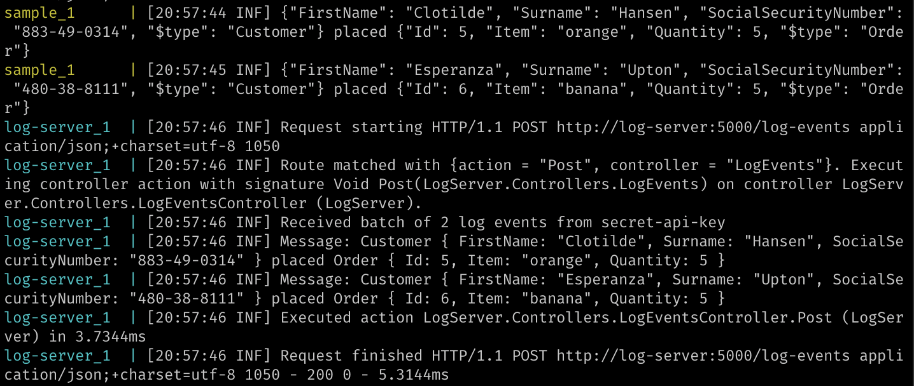

# Serilog.Sinks.Http - Sample in .NET Core

This repository contains a sample application of [Serilog.Sinks.Http](https://github.com/FantasticFiasco/serilog-sinks-http) producing log events sent over HTTP to a basic log server.

## Running the application

1. Run `docker compose up`

What you will end up with is two containers, one producing log events while the other consumes the log events.

## Remarks

- The sample application is using a custom implementation of a HTTP client, mainly to show that it is possible to do so. But don't specify a custom implementation if you don't have to.
- The sink is configured in code, but could as well be configured in `appsettings.json` using [Serilog.Settings.Configuration](https://github.com/serilog/serilog-settings-configuration).